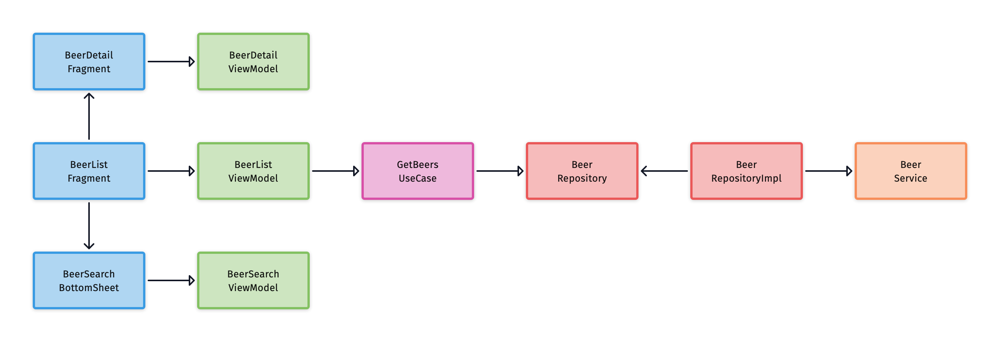

# BeersTest

A small demo application that allows the user to browse a list of beers and to search them by name. The goal of the project is presenting an architecture that is scalable, maintainable, and testable.

## Project characteristics

- 100% [Kotlin](https://kotlinlang.org/)
- Model-View-Intent
- Repository Pattern
- A single activity architecture
- [Android Jetpack](https://developer.android.com/jetpack)
- Reactive UI
- Testing
- Dependency Injection
- [Gradle Kotlin DSL](https://docs.gradle.org/current/userguide/kotlin_dsl.html)
- Material Design

## Libraries

- [Coroutines](https://kotlinlang.org/docs/reference/coroutines-overview.html) - For managing background threads.
- [Flow](https://kotlin.github.io/kotlinx.coroutines/kotlinx-coroutines-core/kotlinx.coroutines.flow/-flow/) - A cold asynchronous data stream that sequentially emits values.
- [SharedFlow](https://kotlin.github.io/kotlinx.coroutines/kotlinx-coroutines-core/kotlinx.coroutines.flow/-shared-flow/) - A hot Flow that shares emitted values among all its collectors in a broadcast fashion.
- [StateFlow](https://kotlin.github.io/kotlinx.coroutines/kotlinx-coroutines-core/kotlinx.coroutines.flow/-state-flow/) - A SharedFlow that represents a state with a single updatable data value.
- Jetpack
  - [ViewModel](https://developer.android.com/topic/libraries/architecture/viewmodel) - Store UI-related data that isn't destroyed on app rotations.
  - [Navigation](https://developer.android.com/guide/navigation) - Handle everything needed for in-app navigation.
  - [Hilt](https://developer.android.com/training/dependency-injection/hilt-android) - Dependency Injection library for Android that reduces the boilerplate of doing manual DI.
- [Retrofit](https://square.github.io/retrofit/) - A type-safe HTTP client.
- [Moshi](https://github.com/square/moshi) - A modern JSON library for Kotlin and Java.
- [Coil](https://coil-kt.github.io/coil/) - An image loading and caching library.
- [Timber](https://github.com/JakeWharton/timber) - A logger with a small, extensible API.
- [MockK](https://mockk.io/) - Mocking library for Kotlin.
- [Kotest](https://github.com/kotest/kotest) - Powerful, elegant and flexible test framework for Kotlin.
- [and more...](buildSrc/src/main/java/Dependencies.kt)

## Architecture

The application is based on MVI architecture, fetching data from the network via repository pattern.

## Punk API

The application uses the [Punk API](https://punkapi.com) to load the list of beers.

